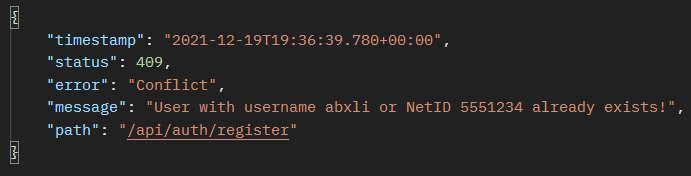
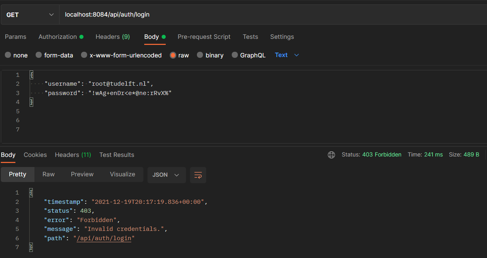
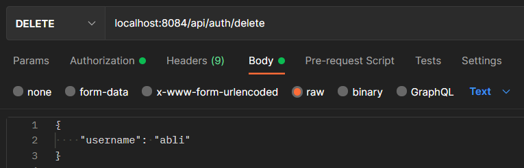

# Authentication
## Postman examples (manual testing)
<!Post here some (no pun intended) Postman examples for your microservice and what to expect>
**Authentication**:
- ```Login with the root user with username root@tudelft.nl and password "!wAg+enDr<e*@ne:rRvX%".```\
  \
  Which gives a HttpStatus ```200 - OK```.\
  \
  And also sets the Authorization header with the JWT from the root user.\
  

- ```Register a new user with username abli and userId 5551234 and password "HashedPassword".```\
   \
   Which gives a HttpStatus ```200 - OK```.\
   

- ```Register the same user with username abli, but different userId 5551235 and password "HashedPassword".```\
  \
  Which gives a HttpStatus ```409 - CONFLICT```.\
  

- ```Register the same user with different username abxli, but same userId 5551234 and password "HashedPassword".```\
  \
  Which gives a HttpStatus ```409 - CONFLICT```.\
  


- ```Login with username abli and password "HashedPassword".```\
  \
  Which gives a HttpStatus ```200 - OK```.\
  \
  And sets the jwt token in the Authorization header.
  

- ```Login with username abli and wrong password "hashedpassword".```\
  \
  Which gives a HttpStatus ```403 - FORBIDDEN```.\
  

- ```Change the user abli to TA with the root user without authorization header.```\
  \
  Which gives a HttpStatus ```403 - FORBIDDEN```.\
  

- ```Now we try the same but now with the authorization header from the root user.```\
  \
  Which gives a HttpStatus ```200 - OK```.\
  


- ```Change the password of the root user with sending the authorization header containing the JWT from the root user.```\
  \
  \
  Which gives a HttpStatus ```200 - OK```.\
  

- ```Try logging in with the root user with the old password.```\
  Which gives a HttpStatus ```403 - FORBIDDEN```.\
  

- ```Try again but now with the new password.```\
  \
  Which gives a HttpStatus ```200 - OK```.\
  

- ```Delete the user abli with Authorization header containing the JWT from the root user.```\
  \
  Which gives a HttpStatus ```200 - OK```.\
  


**Notifications**:
- ```Add a new notification as a root user.```\
  \
  Which gives a HttpStatus ```200 - OK```.\
  \
  Repeat the request 3 times.

- ```Now login again with the root user to see the notificiations.```\
  

- ```Change the message from notification.```\
  \
  Which gives a HttpStatus ```200 - OK```.\
  

- ```Get all the notifications from the root user.```\
  \
  Which gives a HttpStatus ```200 - OK```.\
  

- ```Delete all notifications from the root user as the root user.```\
  \
  Which gives a HttpStatus ```200 - OK```.

- ```Now login again with the root user to see the notificiations.```\
  \
  Which gives a HttpStatus ```200 - OK``` and also displays a message "No new notifications".


## Testing naming convention
We decided to use the following naming convention for the tests in the authentication microservice:
```<methodWeWantToTest><ConditionWeWantTest>Test()```

## Other notes
We have a test class to test our ```AuthenticationMain.java``` class which is named ```AuthenticationMainTest.java```. 
This class is there solely to cover the main Authentication class during testing.