# Testing Documentation for Courses
For the courses microservice, manual testing was done with the help of Postman. 
In order to do this test, we ran the courses, gateway and authentication microservices
as the courses microservice isn't dependent on the other microservices, and these were required
for proper testing. 

Furthermore, due to this most of the functionality is tested in the integration tests
for the controller as the only things that are mocked are the HTTP requests sent to the controller. 
This means that the code from the controller to the database has been tested in those automated tests.
Because of that, we kept the manual tests shorter as the main focus is to see if the microservices are connected properly,
and to see if the endpoints are functional.

Due to th

## Postman examples
We tested each endpoint to see if it functions as intended. 
Before each request to the course microservice there is a request sent to the authentication microservice
to get the valid JWT token in the header as shown below. 

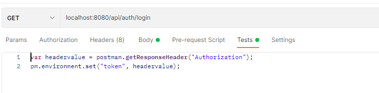

With the result being the following:
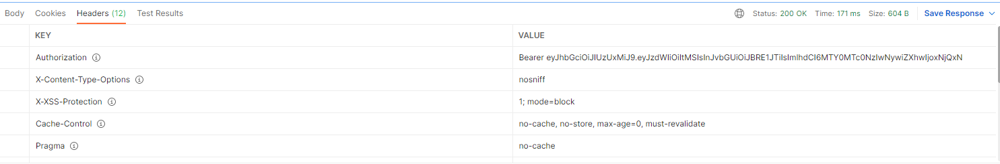

### Creating a new course

**Sending the request:**
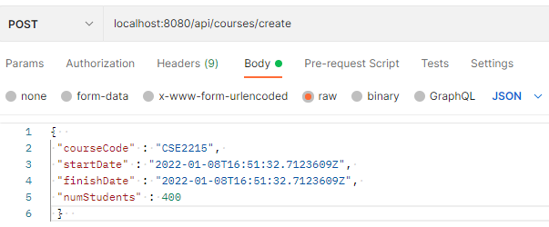

**Recieving the response:**
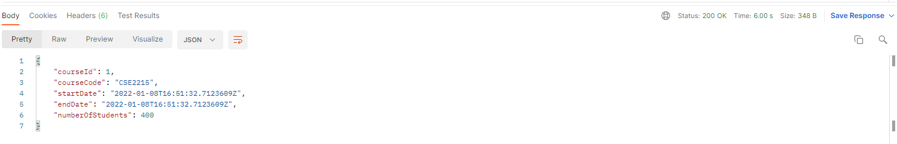
This clearly gives us a 200 OK response as shown in the image above. 

## Get Courses by course code
**Sending the request**
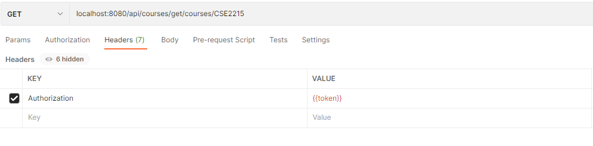
**Receiving the response**
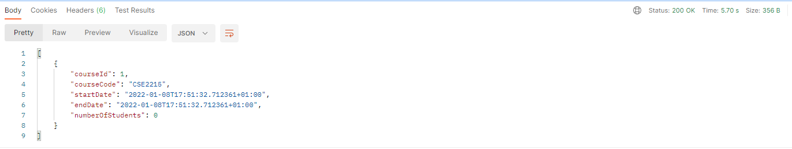
The request body is as expected, an array of json objects.

##Get Course by Id
**Sending the request**
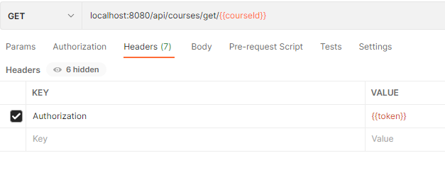
As you can see above, the {{courseId}} notation is actually a placeholder for the courseid
returned by the create courses request. In this test, the value it has is 1.

**Receiving the response:**
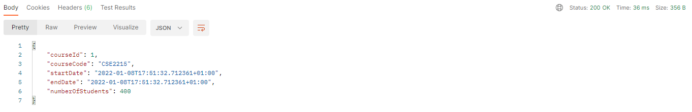

## Get Multiple Courses
**Sending the request:**
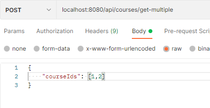

**Receiving the response**
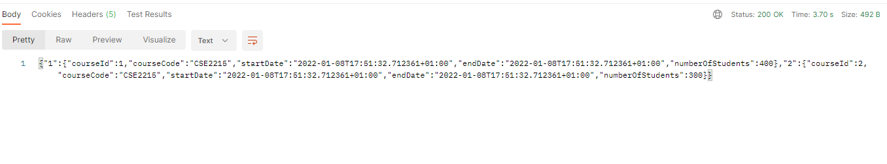

## Get all editions of a course
**Sending the request**
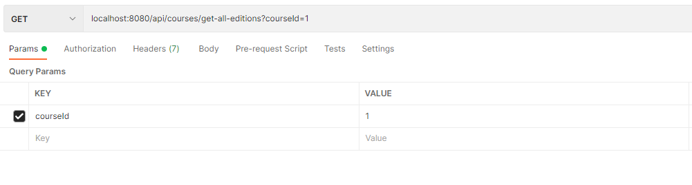

**Receiving the response**
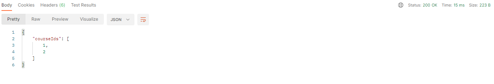

## Add grade
**Sending the request**
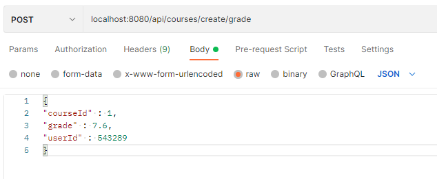

**Receiving the response**
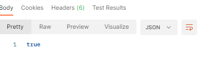

## Get multiple user grades
For this test, we had to create 3 grades before hand using the add grade method. 
The request bodies are shown below:
```JSON
{
"courseId" : 1,
"grade" : 5.2,
"userId" : 1
}
```
```JSON
{
  "courseId" : 1,
  "grade" : 9.9,
  "userId" : 2
}
```
```JSON
{
"courseId" : 1,
"grade" : 10,
"userId" : 3
}
```

**Sending the request**
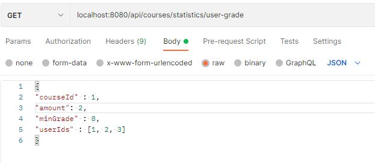

**Receiving the response**
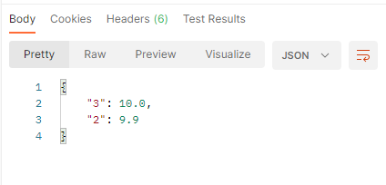

## Delete course
**Sending the request**
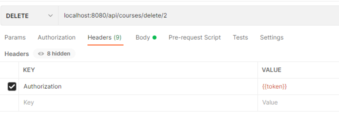
**Receiving the response**
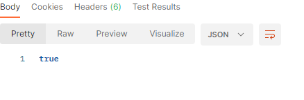

## Get grade of user for course
**Sending the request**
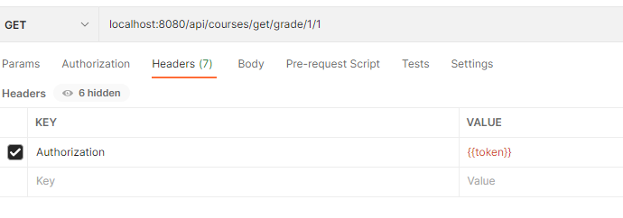
**Receiving the reseponse**
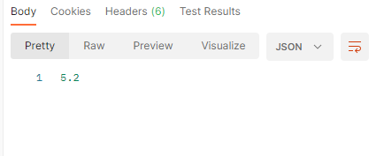

## Assigning Lecturer to course
**Sending the request**
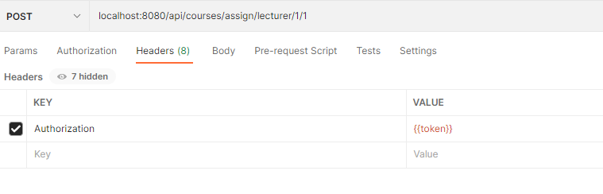

**Receiving the response**
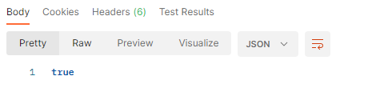

##Get courses of lecturer
**Sending the request**
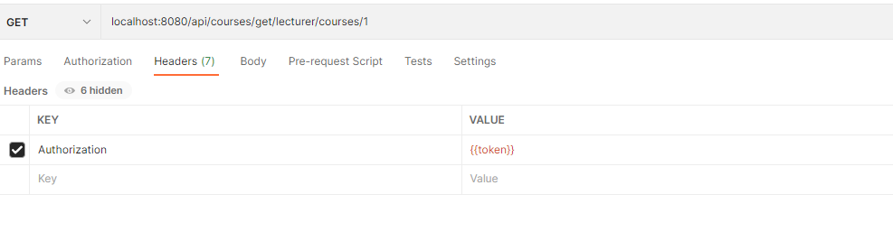
**Receiving the response**
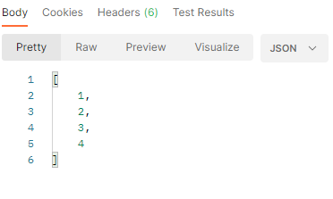

## Does lecturer teach course
**Sending the request**
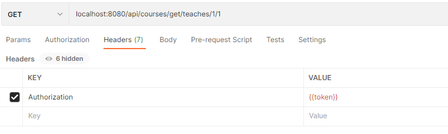
**Receiving the response**
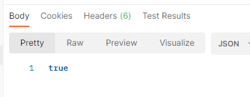