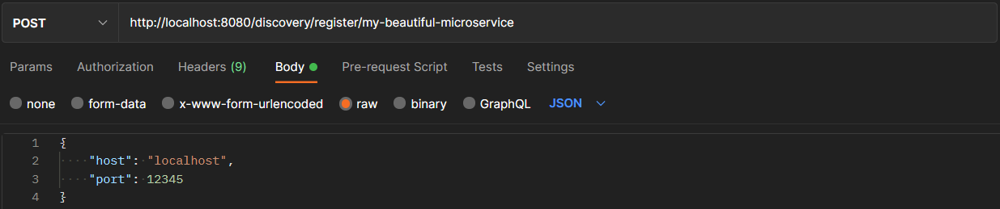
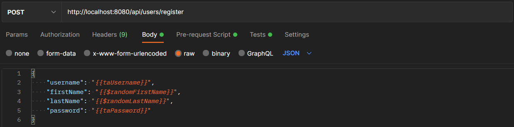

# Gateway

This document contains the following testing-related topics:

1. [Postman examples (manual testing)](#postman-examples-manual-testing)
2. [Integration testing](#integration-testing)
3. [Testing naming conventions](#testing-naming-conventions)

## Postman examples (manual testing)

The following subsections contain manual tests for the Gateway. These tests can also be used as an example of how to use the Gateway.

Almost all tests use randomized global variables which look as follows: `{{variable_name}}`. These variables are replaced with the actual values when the request is sent. 

### Register microservice

1. **Register endpoint for microservice**\
   \
   Which gives a HttpStatus `200 Ok` response.

2. **Register endpoint using incorrect information**\
   \
   Which gives a HttpStatus `400 Bad Request` response. This message is created by Spring as it is unable to validate the registration request body (intended). This endpoint should technically only be used by other microservices that are aware of the Gateway's API.
   ```json
   {
    "timestamp": "2022-01-08T10:36:57.563+00:00",
    "status": 400,
    "error": "Bad Request",
    "message": "Required request body is missing: private void nl.tudelft.sem.gateway.controller.DiscoveryRegistrarController.registerMicroservice(java.lang.String,nl.tudelft.sem.gateway.discovery.Registration)",
    "path": "/discovery/register/my-beautiful-microservice"
   }
   ```

3. **Retrieve registered endpoint**\
   \
   Which gives a HttpStatus `200 Ok` response. The response body is as follows.
   ```json
   {
    "host": "localhost",
    "port": 12345
   }
   ```

### Forward to microservice

1. **Forward call to existing microservice**\
   \
   Which gives the following forwarded response from the microservice that the request was forwarded to (user registration in this example).
   ```json
   {
    "userId": 3001004
   }
   ```

2. **Forward call to non-existing microservice**\
   \
   Which gives a HttpStatus `404 - Not Found` as a response with a suitable error message indicating that there is no microservice registered for that microservice type.
   ```json
   {
    "timestamp": "2022-01-08T09:51:26.415+00:00",
    "status": 404,
    "error": "Not Found",
    "message": "Could not find active microservice registration for 'users' to forward request to",
    "path": "/api/users/register"
   }
   ```

## Integration testing

Since the gateway does not directly depend on other microservices to function, all integration tests that have been performed rely on made up mock endpoints. The interaction between the `GatewayController` and the registry server is thoroughly tested using integration tests. The behaviour of both components is **not** mocked.

## Testing naming conventions

We decided to use the following naming convention for the tests in the gateway microservice:
```test<MethodWeWantToTest><ConditionWeWantTest>()```\
And for the classes it is in the format: ```<ClassWeWantToTest>Test.java```.

Within the test methods we use the AAA (Arrange - Act - Assert) convention, and they are clearly separated by empty lines.

