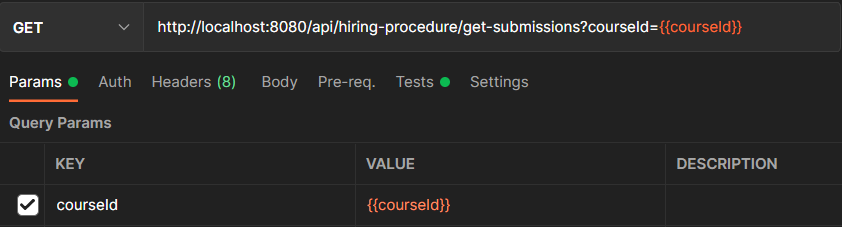

# Hiring Procedure

This document contains the following testing-related topics:

1. [Postman examples (manual testing)](#postman-examples-manual-testing)
2. [Integration testing](#integration-testing)
3. [Mutation testing and boundary testing](#mutation-testing-and-boundary-testing)
4. [Testing naming conventions](#testing-naming-conventions)

## Postman examples (manual testing)

The following subsections contain manual tests for the Hiring Procedure microservice. These tests can also be used as an example of how to use the service itself.

Almost all tests use randomized global variables which look as follows: `{{variable_name}}`. These variables are replaced with the actual values when the request is sent.

**Note:** it is very hard to manually set up a course and apply for it due to all the checks that are made (submission period, declaration period, etc.). Therefore, some tests that are capable of performing certain operations on a variety of students, will only show those changes for a single student. However, these situations will arise in normal use.

### Apply for a TA position
   \
   Which gives an HttpStatus `200 Ok` response.

### Approve an application
   \
   Which gives an HttpStatus `200 Ok` response.

### Reject an application
   \
   Which gives an HttpStatus `200 Ok` response.

### Withdraw an application
   \
   Which gives an HttpStatus `200 Ok` response.

### Get all submissions for a course
   \
   Which gives an HttpStatus `200 Ok` response and the json below.
   ```json
   [
      {
         "applicationId": 1,
         "userId": 3001006,
         "courseId": 9,
         "status": "IN_PROGRESS",
         "submissionDate": "2021-12-20T10:59:48.44297",
         "lastUpdate": "2021-12-20T10:59:48.520019"
      }
  ]
   ```

### Get all submissions
   \
   Which gives an HttpStatus `200 Ok` response and the json below.
   ```json
   [
      {
         "applicationId": 1,
         "userId": 3001006,
         "courseId": 9,
         "status": "IN_PROGRESS",
         "submissionDate": "2021-12-20T10:59:48.44297",
         "lastUpdate": "2021-12-20T10:59:48.520019"
      }
  ]
   ```

### Set max hours
   \
   Which gives an HttpStatus `200 Ok`


### Get max hours
   \
   Which gives an HttpStatus `200 Ok` response and the json below.
   ```json
   125
   ```

### Set rating
   \
   Which gives an HttpStatus `200 Ok`


### Get rating
   \
   Which gives an HttpStatus `200 Ok` response and the json below.
   ```json
   8.8
   ```

## Integration testing

Because of its multiple interactions with other microservices, which would be very difficult to set up in a real testing environment, we have decided to opt for testing using mocks to keep the complexity of the tests down. Therefore, there has not been a great amount of integration testing.

## Mutation testing (and boundary testing)

The hiring-procedure microservice has, according to the PIT report, a mutation score of **95%**. As pitest is also responsible
for changing boundary conditions in mutants, we can therefore safely say that all boundary conditions are properly tested. An example
of a boundary test can be found in the `validation/AsyncCourseTimeValidatorTest.java` file. 

## Testing naming conventions
We decided to use the following naming convention for the tests in the hiring-procedure microservice:
```test<MethodWeWantToTest><ConditionWeWantTest>()```\
And for the classes it is in the format: ```<ClassWeWantToTest>Test.java```.

Within the test methods we use the AAA (Arrange - Act - Assert) convention, and they are clearly separated by empty lines.

