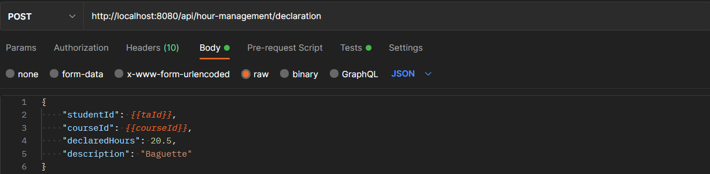
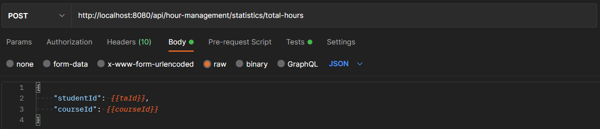
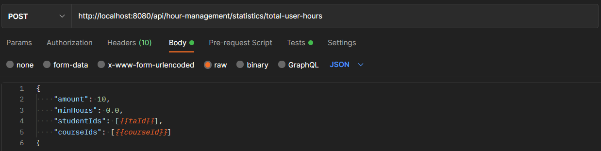

# Hour Management

This document contains the following testing-related topics:

1. [Postman examples (manual testing)](#postman-examples-manual-testing)
2. [Integration testing](#integration-testing)
3. [Testing naming conventions](#testing-naming-conventions)

## Postman examples (manual testing)

The following subsections contain manual tests for the Hour Management microservice. These tests can also be used as an example of how to use the service itself.

Almost all tests use randomized global variables which look as follows: `{{variable_name}}`. These variables are replaced with the actual values when the request is sent.

**Note:** it is very hard to manually set up a course and apply for it due to all the checks that are made (submission period, declaration period, etc.). Therefore, some tests that are capable of performing certain operations on a variety of students, will only show those changes for a single student.

### Declare hours

1. **Let a TA declare hours for the course they TA**\
   
   Which gives a HttpStatus `200 Ok` response. The user is informed that a declaration has been made by returning the JSON response below.
   ```json
   {
    "message": "Declaration with id 2 has been successfully saved."
   }
   ```

### Fetch declarations

1. **Get all unapproved declarations for all courses/a single course**\
   
   
   Which gives a HttpStatus `200 Ok` response. All requested declarations are returned as a JSON list (see example below). This example only contains the result for a single course, due to the TA application and declaration periods.
   ```json
   [
    {
        "declarationId": 1,
        "studentId": 3001021,
        "courseId": 10,
        "approved": false,
        "declaredHours": 20.5,
        "description": "Baguette",
        "declarationDate": "2022-01-08T14:37:55.973132+01:00"
    },
    {
        "declarationId": 2,
        "studentId": 3001021,
        "courseId": 10,
        "approved": false,
        "declaredHours": 20.5,
        "description": "Baguette",
        "declarationDate": "2022-01-08T14:41:29.840252+01:00"
    }
   ]
   ```

2. **Fetch single declaration**\
   
   Which gives a HttpStatus `200 Ok` response. The declaration is returned as a JSON object (see example below).
   ```json
   {
    "declarationId": 2,
    "studentId": 3001021,
    "courseId": 10,
    "approved": true,
    "declaredHours": 20.5,
    "description": "Baguette",
    "declarationDate": "2022-01-08T14:41:29.840252+01:00"
   }
   ```

### Approve/reject declarations

1. **Approve declaration**\
   
   Which gives a HttpStatus `200 Ok` response. The user is informed that the declaration has been approved by the response code. \
   Fetching the declarations using one of the [fetch](#fetch-declarations) methods will show the updated declaration.
   ```json
   [
    {
        "declarationId": 1,
        "studentId": 3001021,
        "courseId": 10,
        "approved": false,
        "declaredHours": 20.5,
        "description": "Baguette",
        "declarationDate": "2022-01-08T14:37:55.973132+01:00"
    },
    {
        "declarationId": 2,
        "studentId": 3001021,
        "courseId": 10,
        "approved": true,
        "declaredHours": 20.5,
        "description": "Baguette",
        "declarationDate": "2022-01-08T14:41:29.840252+01:00"
    }
   ]
   ```
2. **Reject declaration**\
   
   Which gives a HttpStatus `200 Ok` response. The user is informed that the declaration has been rejected by the response code. \
   Fetching the declarations using one of the [fetch](#fetch-declarations) methods will show the updated declaration. This declaration no longer exists (declaration 1).
   ```json
   [
    {
        "declarationId": 2,
        "studentId": 3001021,
        "courseId": 10,
        "approved": true,
        "declaredHours": 20.5,
        "description": "Baguette",
        "declarationDate": "2022-01-08T14:41:29.840252+01:00"
    }
   ]
   ```

3. **Sent notifications (visible upon login)**
   The JSON message below is showed to the TA upon login after tests 1 and 2 (see requests above) were executed.
   ```json
   {
    "notifications": [
        {
            "message": "Your declaration with id 2 has been approved.",
            "notificationDate": "14:48 8-1-2022 Europe/Amsterdam"
        },
        {
            "message": "Your declaration with id 1 has been rejected.",
            "notificationDate": "14:56 8-1-2022 Europe/Amsterdam"
        }
    ]
   }
   ```

### Statistics

1. **Get total hours for TA for course**
   
   Which gives a HttpStatus `200 Ok` response. The total hours for the TA spent on a particular course is returned as a JSON object (see example below).
   ```json
   {
    "totalHours": 20.5
   }
   ```
   
2. **Total hours per TA for all given courses**
   
   Which gives a HttpStatus `200 Ok` response. The total hours per TA for a set of TAs that have worked on a specific set of courses.
   ```json
   {
    "3001021": 20.5
   }
   ```

## Integration testing

Except for the authentication library and remote microservice endpoints, most of the components have not been mocked. All tested components interact with an in-memory H2 database (only during testing).

## Testing naming conventions
We decided to use the following naming convention for the tests in the hour-management microservice:
```test<MethodWeWantToTest><ConditionWeWantTest>()```\
And for the classes it is in the format: ```<ClassWeWantToTest>Test.java```.

Within the test methods we use the AAA (Arrange - Act - Assert) convention, and they are clearly separated by empty lines.

