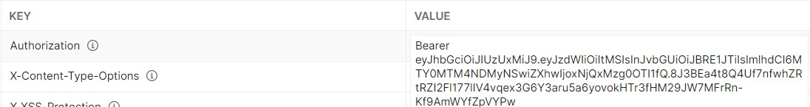
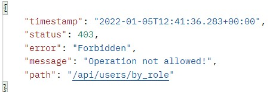
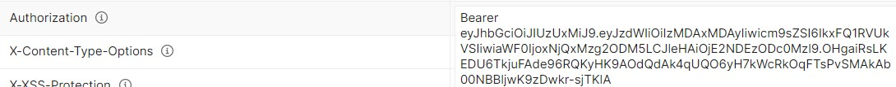

# Users

## Postman examples
<!Post here some (no pun intended) Postman examples for your microservice and what to expect>

**NB! Tokens have certain validity time. Thus, periodically you need to log in again to get a fresh one.**

### Register user

1. **Register a new user with username jzelenjak and blank first name.**\
   \
   Which gives a HttpStatus ```409 - CONFLICT```.\
   

2. **Register the same new user with username jzelenjak and empty username.**\
   \
   Which gives a HttpStatus ```409 - CONFLICT```.\
   

3. **Register the same new user with username jzelenjak and the first and last name and password as on the image.**\
   \
   Which gives a HttpStatus ```200 - OK```.\
   \
   And also gives the generated user ID for the new user.\
   

4. **Register the same user with username jzelenjak as in the previous request.**
   \
   Which gives a HttpStatus ```409 - CONFLICT```.\
   


### Get user by username

1. **Get the user with username jzelenjak but put an invalid token into 'Authorization' header.**\
   \
   Which gives a HttpStatus ```403 - FORBIDDEN```.\
   

2. **Get a non-existing user with username jzalenjak and put a token for the root user or any admin or lecturer (as shown below).**\
   \
   Which gives a HttpStatus ```404 - NOT FOUND```.\
   \
   To get a token for the root user, log in with Authentication Server with his credentials (as shown on the image).\
   \
   Which gives back a token for the root user.\
   

3. **Get the user with username jzelenjak and put a token for the root user or any admin or lecturer (as shown above).**\
   \
   Which gives a HttpStatus ```200 - OK```.\
   \
   And also gives the JSON representation of the requested user.\
   


### Get user by user ID

1. **Get the user with ID 3001001 but put do not put any token into 'Authorization' header.**\
   \
   Which gives a HttpStatus ```401 - UNAUTHORIZED```.\
   

2. **Get a non-existing user with user ID 3001002 and put a token for the root user or any admin or lecturer (as shown above).**\
   \
   Which gives a HttpStatus ```404 - NOT FOUND```.\
   

3. **Get the user with user ID 3001001 and put a token for the root user or any admin or lecturer (as shown above).**\
   \
   Which gives a HttpStatus ```200 - OK```.\
   \
   And also gives the JSON representation of the requested user.\
   


### Get users by role
0. **Register some new users (exactly as has been done above):**
- Student with username jbastenhof.\
   \
- Student with username bxli.\
   \
- Lecturer with username apanichella (initially student, permission upgrade happens in [Change role section](#change-role)).\
   

1. **Get users with role student but put a token for a student (as shown below).**\
   \
   Which gives a HttpStatus ```403 - FORBIDDEN```.\
   \
   To get a token for a student, log in with Authentication Server with their credentials (e.g. as shown on the image).\
   \
   Which gives back a token for the student.\
   

2. **Get users with non-existing role moderator and put a token for a lecturer (as shown below) or the root user or any admin (as shown above).**\
   \
   Which gives a HttpStatus ```400 - BAD REQUEST```.\
   \
   To get a token for a lecturer, log in with Authentication Server with their credentials (e.g. as shown on the image).\
   \
   Which gives back a token for the lecturer.\
   

3. **Get users with the role admin (currently there are no admins) and put a token for a lecturer or the root user or any admin (as shown above).**\
   \
   Which gives a HttpStatus ```404 - NOT FOUND```.\
   \

4. **Get users with the role student and put a token for a lecturer or the root user or any admin (as shown above).**\
   \
   Which gives a HttpStatus ```200 - OK```.\
   \
   And also gives a JSON list of the JSON representations of the requested users.\
   


### Get user by first name

1. **Get users with the first name Jegor but put a token for a student (as has been shown above)**\
   \
   Which gives a HttpStatus ```403 - FORBIDDEN```.\
   

2. **Get users with the first name Jeg (no such users) and put a token for the root user or any admin (as shown above).**\
   \
   Which gives a HttpStatus ```404 - NOT FOUND```.\
   

3. **Get users with the first name Jegor and put a token for the root user or any admin (as shown above).**\
   \
   Which gives a HttpStatus ```200 - OK```.\
   \
   And also gives a JSON list of the JSON representations of the requested users.\
   


### Get user by last name

1. **Get users with the last name Zelenjak but put a token for a lecturer (as has been shown above)**\
   \
   Which gives a HttpStatus ```403 - FORBIDDEN```.\
   

2. **Get users with the last name Zelenjakius (no such users) and put a token for the root user or any admin (as shown above).**\
   \
   Which gives a HttpStatus ```404 - NOT FOUND```.\
   

3. **Get users with the last name Zelenjak and put a token for the root user or any admin (as shown above).**\
   \
   Which gives a HttpStatus ```200 - OK```.\
   \
   And also gives a JSON list of the JSON representations of the requested users.\
   


### Change first name

1. **Change first name of the user with user ID 3001001 but put a token for a lecturer (as has been shown above).**\
   \
   Which gives a HttpStatus ```403 - FORBIDDEN```.\
   

2. **Change first name of a non-existing user with user ID 3001000 and put a token for the root user or any admin (as shown above).**\
   \
   Which gives a HttpStatus ```404 - NOT FOUND```.\
   

3. **Change first name of the user with user ID 3001001 and put a token for the root user or any admin (as shown above).**\
   \
   Which gives a HttpStatus ```200 - OK```.\
   \
   Verify the change by sending a `getUserByUserId` request (exactly as has been done above).\
   \
   Which gives a HttpStatus ```200 - OK```.\
   \
   And also gives the JSON representation of the (updated) requested user.\
   


### Change last name

1. **Change last name of the user with user ID 3001001 but put a token for a student (as has been shown above).**\
   \
   Which gives a HttpStatus ```403 - FORBIDDEN```.\
   

2. **Change last name of a non-existing user with user ID 3001000 and put a token for the root user or any admin (as shown above).**\
   \
   Which gives a HttpStatus ```404 - NOT FOUND```.\
   

3. **Change last name of the user with user ID 3001001 and put a token for the root user or any admin (as shown above).**\
   \
   Which gives a HttpStatus ```200 - OK```.\
   \
   Verify the change by sending a `getUserByUserId` request (exactly as has been done above).\
   \
   Which gives a HttpStatus ```200 - OK```.\
   \
   And also gives the JSON representation of the (updated) requested user.\
   


### Change role

0. **Suppose we register the lecturer from [Get users by role section](#Get-users-by-role). Initially everyone is a student. We want to change the role.**\
   

1. **Change role of the user with user ID 3001001 but put a token for a student (as has been shown above).**\
   \
   Which gives a HttpStatus ```403 - FORBIDDEN```.\
   

2. **Change role of a non-existing user with user ID 3001099 and put a token for the root user or any admin (as shown above).**\
   \
   Which gives a HttpStatus ```404 - NOT FOUND```.\
   

3. **Change role of the user with user ID 3001001 to a non-existing role king and put a token for the root user or any admin (as shown above).**\
   \
   Which gives a HttpStatus ```400 - BAD REQUEST```.\
   

4. **Change role of the user with user ID 3001002 (the user ID of the lecturer registered as a student) and put a token for the root user or any admin (as shown above).**\
   \
   Which gives a HttpStatus ```200 - OK```.\
   \
   And also gives the success message.\
   \
   We verify the change by sending a `getUserByUserId` request (exactly as has been done above).\
   \
   Which gives a HttpStatus ```200 - OK```.\
   \
   And also gives the JSON representation of the (updated) requested user.\
   


### Delete user by user ID

1. **Delete the user with user ID 3001001 but put a token for a student (as has been shown above).**\
   \
   Which gives a HttpStatus ```403 - FORBIDDEN```.\
   

2. **Delete a non-existing user with user ID 30010042 and put a token for the root user or any admin (as shown above).**\
   \
   Which gives a HttpStatus ```404 - NOT FOUND```.\
   

3. **Delete the user with user ID 3001001 and put a token for the root user or any admin (as shown above).**\
   \
   Which gives a HttpStatus ```200 - OK```.\
   \
   And also gives the success message.\
   \
   We verify the change by sending a `getUserByUserId` request (exactly as has been done above).\
   \
   Which gives a HttpStatus ```200 - OK```.\
   


## Testing naming convention

We decided to use the following naming convention for the tests in the users microservice:
```test<MethodWeWantToTest><ConditionWeWantTest>()```\
And for the classes it is in the format: ```<ClassWeWantToTest>Test.java```.

## Integration testing

We decided to use H2 database for testing. Thus, UserService communicates with H2 repository in UserServiceTest and UserControllerTest.

Furthermore, we decided to use mockWebServer to test communication with other microservices.

## Other notes

We have a test class to test our ```UsersMain.java``` class which is named ```UsersMainTest.java```.
This class is there solely to cover the main Users class during testing.